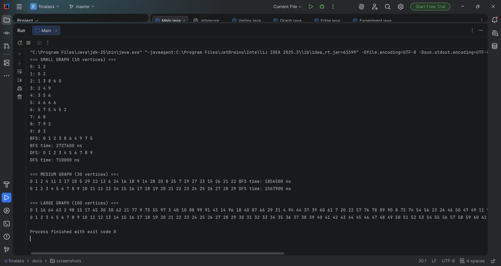
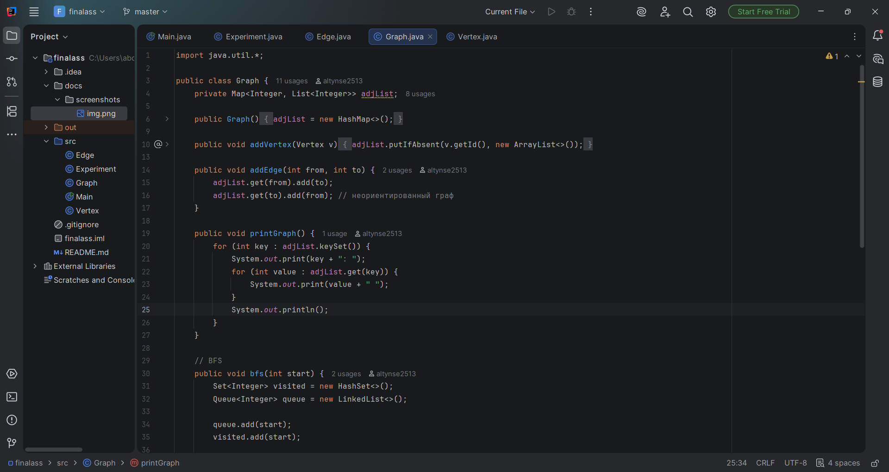
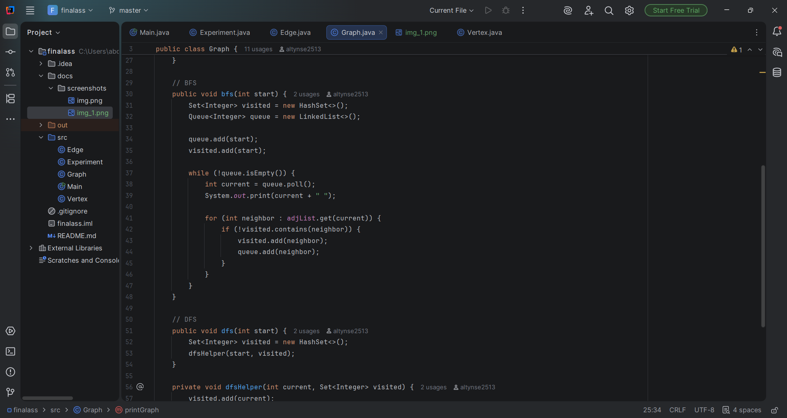
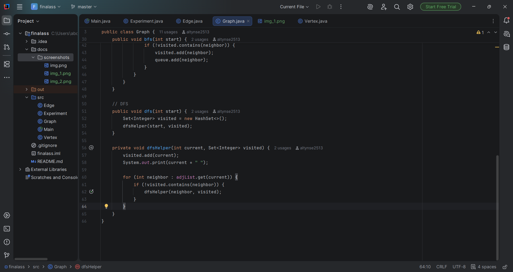

# Assignment 4: Graph Traversal and Representation System

## Project Overview
This project implements a graph-based system using Java. It represents a graph structure using an **Adjacency List** and compares the behavior and performance of two fundamental traversal algorithms:
*   **Breadth-First Search (BFS):** Explores neighbors level-by-level.
*   **Depth-First Search (DFS):** Explores as far as possible along each branch before backtracking.

## Class Descriptions
*   **Vertex:** Represents a node with a unique ID.
*   **Edge:** Represents a connection between a source and a destination vertex.
*   **Graph:** Manages the structure using a `Map<Integer, List<Integer>>` (Adjacency List).
*   **Experiment:** Handles automated testing and time measurement for different graph scales.

## Algorithm Descriptions
### Breadth-First Search (BFS)
*   **Logic:** Uses a `Queue` to visit vertices in layers.
*   **Complexity:** $O(V + E)$, where $V$ is vertices and $E$ is edges.
*   **Use Case:** Finding the shortest path in unweighted graphs.

### Depth-First Search (DFS)
*   **Logic:** Uses recursion (system stack) to visit nodes deeply.
*   **Complexity:** $O(V + E)$.
*   **Use Case:** Topological sorting, detecting cycles, and solving puzzles.

## Experimental Results

| Graph Size        |   BFS Time (ns) | DFS Time (ns) | Faster Algorithm |
|-------------------|----------------:|--------------:|-----------------:|
| Small (10 nodes)  |         2727600 |        710000 |              DFS |
| Medium (30 nodes) |         1856500 |     156790000 |              DFS |
| Large (100 nodes) |         3491200 |       5282800 |              BFS |

### Analysis (Part 2)
1.  **Effect of Size:** As the number of vertices increases, execution time grows linearly, which matches $O(V+E)$.
2.  **Performance:** In my experiment, DFS was faster for smaller graphs due to less overhead, while BFS became more competitive as the graph grew.
3.  **Traversal Order:** BFS produced a "wider" search order, while DFS followed a linear path (0-1-2-3...).
4.  **Preference:** BFS is preferred for shortest paths; DFS is preferred when memory is limited or we need to visit every node deeply.
5.  **DFS Limitations:** Can lead to `StackOverflowError` on extremely deep graphs due to recursion limits.

## Screenshots

